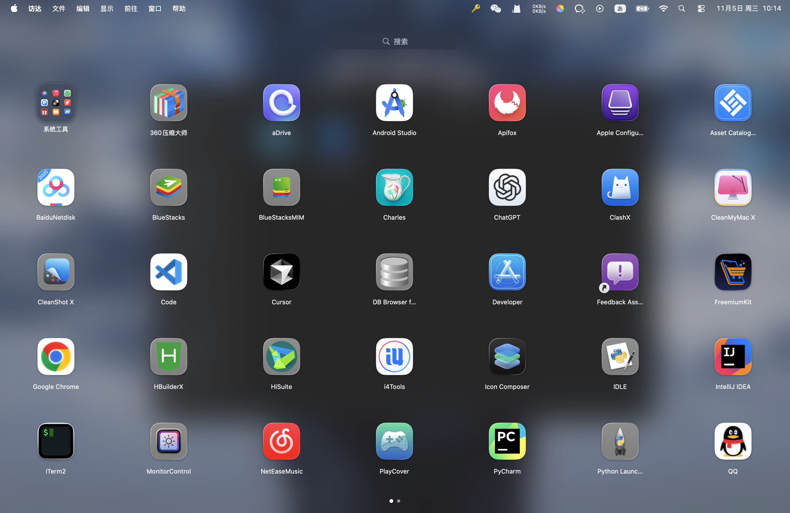

# 🚀 LauncherX — A macOS Launchpad Reimagined

**LauncherX** 是一个用 SwiftUI + AppKit 构建的 macOS 自定义 Launchpad 替代项目。  
它还原了原生 Launchpad 的动画与布局逻辑，并提供更多可扩展的自定义特性。

> 当前项目仍在开发中 🚧  
> 欢迎任何想要完善 macOS 桌面体验的开发者一起参与！

## 🖼️ 预览截图

<div align="center">
  
  <br/>
  <em>模糊背景 + 分页图标 + 系统级动画效果</em>
</div>

---

## ✨ 当前已实现功能

- ✅ **全屏模糊背景**（HUD 风格）
- ✅ **应用图标分页展示**（支持自定义每页行列数）
- ✅ **搜索栏**（即时过滤、实时分页重建）
- ✅ **点击空白处关闭面板**
- ✅ **原生 Launchpad 风格的打开/关闭动画**
- ✅ **模糊材质与动效还原 macOS 视觉层次**
- ✅ **全局快捷键/手势控制入口（计划支持五指合拢打开）**

---

## 🔜 计划中的特性（欢迎参与）

| 功能 | 状态 | 说明 |
|------|------|------|
| 🖱️ 拖拽应用 | 🚧 规划中 | 支持拖拽图标重新排序、跨页移动 |
| 🗑️ 卸载应用 | 🚧 规划中 | 长按图标进入“抖动模式”后可卸载 |
| 📁 文件夹展开 | 🚧 规划中 | 支持创建与展开 App 文件夹，类似原生 Launchpad 动效 |
| 🧩 系统应用支持 | 🚧 规划中 | 系统 App 图标展示、权限访问等 |
| 🔄 动态刷新 | 🚧 规划中 | 检测新安装或卸载的应用，实时更新 |
| 🎛️ 自定义布局 | ✅ 可行 | 行列数量、图标尺寸、分页策略均可调整 |

---

## 🧠 项目结构
LauncherX/
├── LaunchpadModel.swift         # 应用数据与分页逻辑
├── LaunchpadRootView.swift      # 主体 SwiftUI 视图
├── PageGridView.swift           # 网格布局组件
├── CustomPagingSlider.swift     # 分页滑动逻辑
├── LaunchpadWindowManager.swift # 全屏窗口与动画管理
├── InteractiveFullscreenWindow.swift
└── Resources/                   # 图标、预览等资源

---

## 🪄 技术栈

- 🧱 **SwiftUI + AppKit 混合开发**
- 🎨 **macOS VisualEffectView** 模糊材质
- 🌀 **Core Animation 动效驱动**
- 🪶 **自定义 NSWindow (无边框全屏)**  
- 🖐️ **未来计划：Global Gesture（五指合拢）唤起**

---

## 🧩 如何运行

1. 打开工程：
   ```bash
   open LauncherX.xcodeproj
2.	选择目标：My Mac (Designed for macOS)
3.	点击「Run ▶︎」即可运行
4.	启动后可通过以下代码打开界面：
    LaunchpadWindowManager.shared.show()


❤️ 致未来的维护者

这个项目起初是为了更好地理解 macOS 系统界面机制、
并打造一个更加自由、可扩展的 Launchpad。

目前开发者精力有限，
希望有兴趣的朋友能在此基础上继续完善，比如：
	•	拖拽交互
	•	文件夹动画
	•	系统图标同步
	•	Spotlight 集成

让 LauncherX 成为真正属于开发者的 macOS 启动中心。

如果你也热爱系统动效与交互，请为它添砖加瓦吧 🧱✨